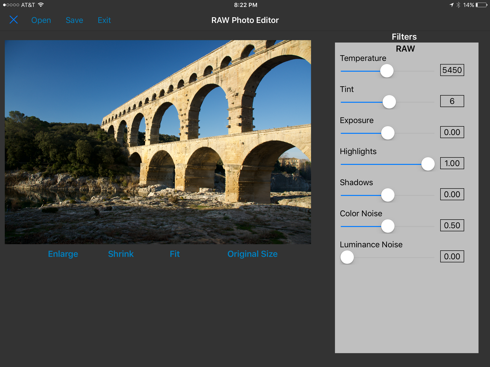

## RAW Photo Editor ##

This photo editor is designed to be run under Pythonista 3 (http://omz-software.com/pythonista/) on iOS.

### Use ###

The main file is RawPhotoEditor.py. Run this file and rotate the view to landscape mode. In the title bar is an **Open** button. Tapping on this button will bring up a dialog which shows the photos in your Photo Library. Select a raw image file and the image will open in the image window. The sliders in the right hand side view will then be populated with their default values. The display will look similar to this after this step:

### Installation ###

Clone this repository into a folder in Pythonista 3
