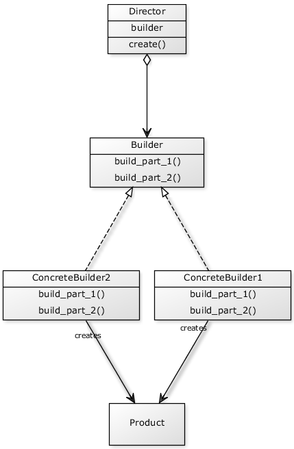
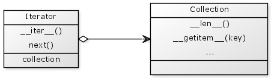
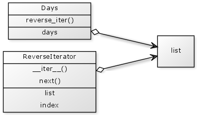

% Design Patterns in Python
% or how I learned to stop worrying and love the gang of four
% David Corne

# Introduction #
This is inspired by the aptly titled *Design Patterns: Elements of Reusable Object-Oriented Software* by Erich Gamma, Richard Helm, Ralph Johnson and John Vlissides who are collectively known as the Gang of Four (GOF).

The content of this book is taken from my blog [here](http://davidcorne.com/category/design-patterns-in-python/).

Why do I want to do this? I want to write this to pass on some knowledge which I have gained working as a software engineer, but also to learn a lot. I think of these as the twin goals of this blog because if I write about something I want to get it right. While I know quite a bit about some design patterns there are others I definitely don't.

# Creational #

## Abstract factory ##
## Builder ##

### The Purpose ###
The idea behind the builder pattern is to abstract away the construction of an object so that many implementations can use the same builder. This separates the construction logic of the desired class from it's representation. 

### The Pattern ###
Here is a general UML diagram for this



So the object you are interested in creating is the class `Product` in this scenario. The class which you call to deal with this is the `Director`.

The `Director` keeps a member which implements the `Builder` interface and calls this in it's `create()` method. This member is one of the `ConcreteBuilder` classes and has the logic needed for the creation of the specific `Product` you want.

This abstracts the logic needed to create different types of `Product`. The `Product` may also be an interface and each `ConcreteBuilder` may return a different type.

The `Builder` is typically set either with a function, where the `Director` class is responsible for the logic of the `ConcreteBuilder` creation, or by passing a `ConcreteBuilder` directly to the `Director`.

### An Example Usage ###
This will use the example of building different types of vehicles. The code for this example is all contained in <!--- <a href="https://github.com/davidcorne/Design-Patterns-In-Python/blob/master/Structural/Builder.py" target="_blank">this file</a>. --->

The Product here is a `Vehicle` which is defined as the following class.

```python
#==============================================================================
class Vehicle(object):

    def __init__(self, type_name):
        self.type = type_name
        self.wheels = None
        self.doors = None
        self.seats = None

    def view(self):
        print(
            "This vehicle is a " +
            self.type +
            " with; " +
            str(self.wheels) +
            " wheels, " +
            str(self.doors) +
            " doors, and " +
            str(self.seats) +
            " seats."
            )
```

So different `Vehicles` can have different names, numbers of wheels doors and seats. The method `view()` will print a summery of what the `Vehicle` is.

The construction of instances of `Vehicle` will be handles by the `ConcreteBuilder` classes. These should derive from a `Builder` interface (abstract class) so here is the base class `VehicleBuilder`.

```python
#==============================================================================
class VehicleBuilder(object):
    """
    An abstract builder class, for concrete builders to be derived from.
    """
    __metadata__ = abc.ABCMeta
    
    @abc.abstractmethod
    def make_wheels(self):
        raise

    @abc.abstractmethod
    def make_doors(self):
        raise

    @abc.abstractmethod
    def make_seats(self):
        raise
```

This uses the <a href="http://docs.python.org/2/library/abc.html" target="_blank">abc</a> module just like the first version of PrimeFinder in my <a href="http://davidcorne.com/2013/01/21/strategy-pattern/" target="_blank">strategy pattern</a> post.

So with this `Builder` there are three functions for setting up the `Vehicle`. For the `ConcreteBuilders` there is a `CarBuilder` and a `BikeBuilder`, both of which inherit from `VehicleBuilder`. Here are the implementations of these classes.

```python
#==============================================================================
class CarBuilder(VehicleBuilder):

    def __init__(self):
        self.vehicle = Vehicle("Car ")

    def make_wheels(self):
        self.vehicle.wheels = 4

    def make_doors(self):
        self.vehicle.doors = 3

    def make_seats(self):
        self.vehicle.seats = 5

#==============================================================================
class BikeBuilder(VehicleBuilder):

    def __init__(self):
        self.vehicle = Vehicle("Bike")

    def make_wheels(self):
        self.vehicle.wheels = 2

    def make_doors(self):
        self.vehicle.doors = 0

    def make_seats(self):
        self.vehicle.seats = 2
```

The only logic in these is the creation of the `vehicle` member and setting the properties on it. Now to use these we need a Director class to call. For this example the Director is called `VehicleManufacturer`.

```python
#==============================================================================
class VehicleManufacturer(object):
    """
    The director class, this will keep a concrete builder.
    """
    
    def __init__(self):
        self.builder = None

    def create(self):
        """ 
        Creates and returns a Vehicle using self.builder
        Precondition: not self.builder is None
        """
        assert not self.builder is None, "No defined builder"
        self.builder.make_wheels()
        self.builder.make_doors()
        self.builder.make_seats()
        return self.builder.vehicle
```

`VehicleManufacturer` has a `create()` function which contains the calling code used with the Builder. However as you can see from the docstring and the code this has a precondition of self.builder being set. This means that if you have not given the Director a ConcreteBuilder to use, it cannot create a Vehicle.

So this class is called like so.

```python
#==============================================================================
if (__name__ == "__main__"):
    manufacturer = VehicleManufacturer()
    
    manufacturer.builder = CarBuilder()
    car = manufacturer.create()
    car.view()

    manufacturer.builder = BikeBuilder()
    bike = manufacturer.create()
    bike.view()
```

The calling code uses one VehicleManufacturer to build both a car and a bike. The output of this code is given below.

```pycon
This vehicle is a Car  with; 4 wheels, 3 doors, and 5 seats.
This vehicle is a Bike with; 2 wheels, 0 doors, and 2 seats.
```

The specific UML for this example is this.


## Factory method ##
## Lazy initialization ##
## Multiton ##
## Object pool ##
## Prototype ##
## Resource acquisition is initialization ##
## Singleton ##

# Structural #
## Adapter ##
## Bridge ##
## Composite ##
## Decorator ##
## Facade ##
### The Purpose ###

The facade pattern is used to make one object with a simple interface represent a complicated system. The problem often occurs in programming where you have a series of interconnected classes where the functions must be called in a certain order or have complicated interdependencies.

This pattern is to give a standard interface to such a system, so you don't have to rely on reading how you call the system in one of the files or look at example usage.

### The Pattern ###
Here is a UML diagram representing the pattern.

<!--
[caption width="380" align="aligncenter"]<a href="http://www.dofactory.com/Patterns/Diagrams/facade.gif"></a> UML for Facade pattern[/caption]
-->

This shows that the pattern is just one class which groups together a lot of other objects and uses them in some way.

### An Example Usage###

Here is an implementation of this in python. For this example I am using a car. As this is a small example I will not create a whole complex sub-system, just a few classes.

Here are the three classes which make up the sub-system; Engine, StarterMotor and Battery.

```python
#==============================================================================
class Engine(object):
    
    def __init__(self):
        # how much the motor is spinning in revs per minute
        self.spin = 0

    def start(self, spin):
        if (spin > 2000):
            self.spin = spin // 15

#==============================================================================
class StarterMotor(object):
    
    def __init__(self):
        # how much the starter motor is spinning in revs per minute
        self.spin = 0

    def start(self, charge):
        # if there is enough power then spin fast
        if (charge > 50):
            self.spin = 2500

#==============================================================================
class Battery(object):

    def __init__(self):
        # % charged, starts flat
        self.charge = 0
```

So now we need our facade object which will work as a common interface for the car.

```python
#==============================================================================
class Car(object):
    # the facade object that deals with the battery, engine and starter motor.
    
    def __init__(self):
        self.battery = Battery()
        self.starter = StarterMotor()
        self.engine = Engine()
        
    def turn_key(self):
        # use the battery to turn the starter motor
        self.starter.start(self.battery.charge)

        # use the starter motor to spin the engine
        self.engine.start(self.starter.spin)
        
        # if the engine is spinning the car is started
        if (self.engine.spin > 0):
            print("Engine Started.")
        else:
            print("Engine Not Started.")

    def jump(self):
        self.battery.charge = 100
        print("Jumped")
```

This enables the user of Car to use the system as it was intended to be used. I include this at the bottom of the python module so that on running it makes a car, tries to start it, then jumps it to start it.

```python
#==============================================================================
if (__name__ == "__main__"):
    corsa = Car()
    corsa.turn_key()
    corsa.jump()
    corsa.turn_key()
```

The output of this program is the following;
```pycon
Engine Not Started.
Jumped
Engine Started.
```

That is a simple example of the facade design pattern. The code for this is on my GitHub <a href="https://github.com/davidcorne/Design-Patterns-In-Python/blob/master/Structural/Facade.py" target="_blank">here</a>.

All of the code for this series can be found in <a href="https://github.com/davidcorne/Design-Patterns-In-Python" target="_blank">this repository</a>.
## Flyweight ##
## Front Controller ##
## Module ##
## Proxy ##
## Telescoping constructor ##

# Behavioural #
## Blackboard ##
## Chain of Responsibility ##
## Command ##
## Data Caching ##
## Interpreter ##
## Iterator ##
This post will be about the Iterator pattern which is a behavioural pattern.

###The Purpose###
The idea behind this pattern is to have an object which you can loop over without needing to know the internal representation of the data. While in python nothing is private so you can find out the internals of the class, the iterator pattern gives you a standard interface.

I think the best example of an iterator in python is using a list. As I'm sure you know this is how you would iterate over a list in python.
```python
list = ["one", "two", "three"]
for number in list:
    print(number)
```

 Which gives the following output.
```pycon
one
two
three
```

The goal of this pattern in python is to be able to do that with a user defined class.

### The Pattern ###

This is quite a small pattern so I will focus more on the implementation detail than the design. 

But in the interest of consistency here is the UML diagram.



So the iterator holds a container by aggregation, so it doesn't own/delete the container, it just has a reference to it.

You can see from this that we are talking about a general collection/data structure here so it is not specific to a list or dictionary for example. The methods on these classes are standard for defining a collection/iterator interface in python and I will go through these in more detail next.

###Python Protocols###

Protocols are the name given in python, for the interface you need to make a certain kind of object. These are not a formal requirement like an interface, but more of a guide.

They focus on pythons magic methods, which are those with double underscores surrounding the name.

I'm going to briefly talk about the protocols for mutable and immutable containers, and iterators.

####Immutable Containers####

An immutable container is one where you cannot change the individual items. For this you only need to be able to get the length of it and access individual items. 

The python magic methods for an immutable container are.

```python
def __len__(self):
    """ Returns the length of the container. Called like len(class) """
def __getitem__(self, key):
    """ 
    Returns the keyth item in the container. 
    Should raise TypeError if the type of the key is wrong.
    Should raise KeyError if there is no item for the key. 
    Called like class[key]
    """
```

Again the exceptions mentioned in __getitem__ are convention, but it's important for writing idiomatic python.

####Mutable Containers####
As you might expect a mutable container has the same methods for accessing items as an immutable container, but adds ways of setting or adding them.

Here are the magic methods.

```python
def __len__(self):
    """ 
    Returns the length of the container. 
    Called like len(class) 
    """
def __getitem__(self, key):
    """ 
    Returns the keyth item in the container. 
    Should raise TypeError if the type of the key is wrong.
    Should raise KeyError if there is no item for the key. 
    Called like class[key]
    """

def __setitem__(self, key, value):
    """ 
    Sets the keyth item in the container. 
    Should raise TypeError if the type of the key is wrong.
    Should raise KeyError if there is no item for the key. 
    Called like class[key] = value
    """

def __delitem__(self, key):
    """ 
    Deletes an item from the collection.  
    Should raise TypeError if the type of the key is wrong.
    Should raise KeyError if there is no item for the key. 
    Called like del class[key]
    """
```

For an immutable container you probably want to have some way of adding elements too. For a list/array style container this might be in the form of a function append(self, key) or for a dictionary/table type container it might be using the __setitem__(self, key, value) function.

There are other functions you can add such as __reversed__(self) and __contains__(self, item) but they are not needed for core functionality. They are very well described <a href="http://www.rafekettler.com/magicmethods.html#sequence" target="_blank">here</a>.

####Iterators####

The protocol for an iterator is very simple.

```python
def __iter__(self):
    """
    Returns an iterator for the collection.
    Called like iter(class) or for item in class:
    """
def next(self):
   """
   Returns the next item in the collection.
   Called in a for loop, or manually.
   Should raise StopIteration on the last item.
   """ 
```
The __iter__ function will typically return another iterator object or return itself. Note in python 3 next() is renamed __next__().

###An Example Usage###
Here is an example of how you might implement a simple iterator. My iterator will loop over a collection in reverse.

```python
#==============================================================================
class ReverseIterator(object):
    """ 
    Iterates the object given to it in reverse so it shows the difference. 
    """

    def __init__(self, iterable_object):
        self.list = iterable_object
        # start at the end of the iterable_object
        self.index = len(iterable_object)

    def __iter__(self):
        # return an iterator
        return self

    def next(self):
        """ Return the list backwards so it's noticeably different."""
        if (self.index == 0):
            # the list is over, raise a stop index exception
            raise StopIteration
        self.index = self.index - 1
        return self.list[self.index]
```

Note this only has the two functions needed for the iterator protocol, as these are all that are needed. 

Hopefully it is fairly obvious what these functions do. The constructor takes some iterable and caches it's length as an index. The __iter__ returns the ReverseIterator as it has a next() function. The next function decrements the index and returns that item, unless there is no item to return at which point it raise StopIteration.

In my example the ReverseIterator is used by a Days class, given here.

```python
#==============================================================================
class Days(object):

    def __init__(self):
        self.days = [
        "Monday",
        "Tuesday", 
        "Wednesday", 
        "Thursday",
        "Friday", 
        "Saturday", 
        "Sunday"
        ]

    def reverse_iter(self):
        return ReverseIterator(self.days)
```

This is just a wrapper for a list of the days of the week, which has a function to return an iterator.

This is how these classes are used.

```python
#==============================================================================
if (__name__ == "__main__"):
    days = Days()
    for day in days.reverse_iter():
        print(day)
```

Note I could have used a __iter__() function in Days instead of reverse_iter(). This would then have been used like this.

```python
#==============================================================================
if (__name__ == "__main__"):
    days = Days()
    for day in days:
        print(day)
```

My reason for not doing this is that this does not make it clear that you are reversing it. 

The output from either of these is.

```pycon
Sunday
Saturday
Friday
Thursday
Wednesday
Tuesday
Monday
```

This code for this can be found in <a href="https://github.com/davidcorne/Design-Patterns-In-Python/blob/master/Behavioural/Iterator.py" target="_blank">this file</a>.

Here is the specific UML for these classes.



All of the code for the design patterns can be found <a href="https://github.com/davidcorne/Design-Patterns-In-Python" target="_blank">here</a>.

## Mediator ##
## Memento ##
## Null object ##
## Observer (Publish/Subscribe) ##
## State ##
## Servant ##
## Specification ##
## Strategy ##
The strategy pattern is a behavioural design pattern. This means that it is a common communication method between objects and not concerned with how those objects are created or structured.

### The Purpose ###

The idea behind the strategy pattern is to encapsulate the implementation details of an algorithm and make them interchangeable. This gives more flexibility in how an object can be used and enables each algorithm to be tested independently of the calling object.

### The Pattern ###

Here is a UML diagram of a typical use of the strategy pattern.


This shows an interface (an unimplemented class denoted by &lt;&lt;&gt;&gt;) called IAlgorithm. The caller class will contain an instance of an object which implements this interface using <a href="http://en.wikipedia.org/wiki/Object_composition#Aggregation" target="_blank">aggregation</a>. This means that the lifetime of the algorithms is not necessarily tied to the caller. The implemented algorithm classes derive from the interface.

### An Example Usage###

I will give two implementations of this pattern; one which is more standard and will closely match the above UML and one which I believe is more pythonic.

#### First Example ####

My example will be using two different algorithms to calculate prime numbers.

Here is the caller class PrimeFinder.

```python
#==============================================================================
class PrimeFinder(object):
    
    def __init__(self, algorithm):
        """ 
        Constructor, takes a lass called algorithm. 
        algorithm should have a function called calculate which will take a 
        limit argument and return an iterable of prime numbers below that 
        limit.
        """ 
        self.algorithm = algorithm
        self.primes = []

    def calculate(self, limit):
        """ Will calculate all the primes below limit. """
        self.primes = self.algorithm.calculate(limit)

    def out(self):
        """ Prints the list of primes prefixed with which algorithm made it """
        print(self.algorithm.name)
        for prime in self.primes:
            print(prime)
        print("")
```

This will be given an algorithm on construction, the contract for the algorithm is that it must have a function called calculate which takes a limit. This is explained in the docstring for __init__ but in a statically typed language such as c++ the constructor would look something like this.

```python
    PrimeFinder(const IAlgorithm& algorithm);
```

We can not (and should not) enforce what is passed into the constructor in python. However we can pass in objects derived from an abstract base class so that our algorithms will definitely work. The functionality of abstract base classes is importable in python from the module abc. So we need this at the top of the file.

```python
import abc
```

Here is the base class I will be using in this example.

```python
#==============================================================================
class Algorithm(object):
    __metaclass__ = abc.ABCMeta

    @abc.abstractmethod
    def calculate(self, limit):
        raise
```

This defines an abstract base class Algorithm. The __metaclass__ line changes the way this class is constructed. If you derive from it and you have not implemented the functions decorated with @abc.abstractmethod the following error will be raised.

```python
TypeError: Can't instantiate abstract class [class] with abstract methods [methods]
```

This enforces the contract that any class deriving from Algorithm will be able to be used in PrimeFinder. So now we can derive our algorithms from this with the following two classes.

```python
#==============================================================================
class HardCoded(Algorithm):
    """ 
    Has hardcoded values for all the primes under 50, returns a list of those
    which are less than the given limit.
    """
    
    def __init__(self):
        self.name = "hard_coded_algorithm"

    def calculate(self, limit):
        hardcoded_primes = [2,3,5,7,11,13,17,19,23,29,31,37,41,43,47]
        primes = []
        for prime in hardcoded_primes:
            if (prime < limit):
                primes.append(prime)
        return primes

#==============================================================================
class Standard(Algorithm):
    """ 
    Not a great algorithm either, but it's the normal one to use.
    It puts 2 in a list, then for all the odd numbers less than the limit if 
    none of the primes are a factor then add it to the list.
    """

    def __init__(self):
        self.name = "standard_algorithm"

    def calculate(self, limit):
        primes = [2]
        # check only odd numbers.
        for number in range(3, limit, 2):
            is_prime = True
            # divide it by all our known primes, could limit by sqrt(number)
            for prime in primes:
                if (number % prime == 0):
                    is_prime = False
                    break
            if (is_prime):
                primes.append(number)
        return primes
```

I am not going to go through all the details of these two classes as that is not what this post is about, I'll just give an overview. 

The first has a hard-coded list and returns all the primes it knows about below the limit you give. 

The second makes a list of primes then iterates over all the odd numbers less than the limit and if none of the primes on the list divide the number it adds it to the list of primes.

The following is the calling code included at the bottom of this file

```python
#==============================================================================
if (__name__ == "__main__"):
    hard_coded_algorithm = HardCoded()
    hardcoded_primes = PrimeFinder(hard_coded_algorithm)
    hardcoded_primes.calculate(50)
    hardcoded_primes.out()

    standard_algorithm = Standard()
    standard_primes = PrimeFinder(standard_algorithm)
    standard_primes.calculate(50)
    standard_primes.out()
```

So you instantiate an algorithm, pass it to the prime finder then call the methods on it and the algorithm you gave it will be used. This code does not show that, as these algorithms give the same results on a limit of 50. The code afterwards shows that they are different.

```python
    print(
        "Do the two algorithms get the same result on 50 primes? %s" 
        %(str(hardcoded_primes.primes == standard_primes.primes))
        )

    # the hardcoded algorithm only works on numbers under 50
    hardcoded_primes.calculate(100)
    standard_primes.calculate(100)

    print(
        "Do the two algorithms get the same result on 100 primes? %s" 
        %(str(hardcoded_primes.primes == standard_primes.primes))
        )
```

Which prints the following

```python
Do the two algorithms get the same result on 50 primes? True
Do the two algorithms get the same result on 100 primes? False
```

Here is the specific UML diagram for these.


The code for this implementation is found in <a href="https://github.com/davidcorne/Design-Patterns-In-Python/blob/master/Behavioural/Strategy_old.py" target="_blank">this file</a>.

__Second Example__

The previous example is more how you would implement this pattern in a statically typed language such as C++ or C#. This is a more pythonic approach which will take some advise I heard in a talk; classes with only a __init__ function and one other function are functions in disguise. As functions are first class objects in python there is a lot we can do with them and I believe this gives a more pythonic variant of the strategy pattern.

Here is the calling class.

```python
#==============================================================================
class PrimeFinder(object):
    
    def __init__(self, algorithm):
        """ 
        Constructor, takes a callable object called algorithm. 
        algorithm should take a limit argument and return an iterable of prime 
        numbers below that limit.
        """ 
        self.algorithm = algorithm
        self.primes = []

    def calculate(self, limit):
        """ Will calculate all the primes below limit. """
        self.primes = self.algorithm(limit)

    def out(self):
        """ Prints the list of primes prefixed with which algorithm made it """
        print(self.algorithm.__name__)
        for prime in self.primes:
            print(prime)
        print("")
```

There are a few differences between this and the class PrimeFinder in the previous example. This one asks for a callable object rather than an object with a calculate method, this is reflected in the implementation of calculate where it calls the passed in object. The other difference is that it does not need a property name it uses the python built in __name__.

This means we can pass functions into the class. Here are two functions which correspond to the previous classes.

```python
#==============================================================================
def hard_coded_algorithm(limit):
    """ 
    Has hardcoded values for all the primes under 50, returns a list of those
    which are less than the given limit.
    """
    hardcoded_primes = [2,3,5,7,11,13,17,19,23,29,31,37,41,43,47]
    primes = []
    for prime in hardcoded_primes:
        if (prime < limit):
            primes.append(prime)
    return primes

#==============================================================================
def standard_algorithm(limit):
    """ 
    Not a great algorithm either, but it's the normal one to use.
    It puts 2 in a list, then for all the odd numbers less than the limit if 
    none of the primes are a factor then add it to the list.
    """
    primes = [2]
    # check only odd numbers.
    for number in range(3, limit, 2):
        is_prime = True
        # divide it by all our known primes, could limit by sqrt(number)
        for prime in primes:
            if (number % prime == 0):
                is_prime = False
                break
        if (is_prime):
            primes.append(number)
    return primes
```

These are called in almost the same way as using the classes.

```python
#==============================================================================
if (__name__ == "__main__"):
    hardcoded_primes = PrimeFinder(hard_coded_algorithm)
    hardcoded_primes.calculate(50)
    hardcoded_primes.out()

    standard_primes = PrimeFinder(standard_algorithm)
    standard_primes.calculate(50)
    standard_primes.out()
```

As this can take any callable object this can also be a class. A class in python is also a callable object. When a class is called an object is made so the function in PrimeFinder

```python
def calculate(self, limit):
        """ Will calculate all the primes below limit. """
        self.primes = self.algorithm(limit)
```

will set self.primes to an instance of the class. As out() needs only that the object self.primes is iterable we can use the python magic method __iter__ to make that so.

Here is the implementation of a class which can be passed in to PrimeFinder.

```python
#==============================================================================
class HardCodedClass(object):
    
    def __init__(self, limit):
        hardcoded_primes = [2,3,5,7,11,13,17,19,23,29,31,37,41,43,47]
        self.primes = []
        for prime in hardcoded_primes:
            if (prime < limit):
                self.primes.append(prime)
        
    def __iter__(self):
        return iter(self.primes)
```

This is called in the following way.

```python
    class_primes = PrimeFinder(HardCodedClass)
    class_primes.calculate(50)
    class_primes.out()
```

Note that HardCodedClass has no brackets after it, this is because the class is being passed in as an object not an instance of the class.

Another thing to note is that although I have used different instances of PrimeFinder in my calling code I could have just set the property algorithm in the following way.

```python
#==============================================================================
if (__name__ == "__main__"):
    prime_finder = PrimeFinder(hard_coded_algorithm)
    prime_finder.calculate(50)
    prime_finder.out()

    prime_finder.algorithm = standard_algorithm
    prime_finder.calculate(50)
    prime_finder.out()

    prime_finder.algorithm = HardCodedClass
    prime_finder.calculate(50)
    prime_finder.out()
```

The code for this specific file can be found <a href="https://github.com/davidcorne/Design-Patterns-In-Python/blob/master/Behavioural/Strategy.py" target="_blank">here</a>. All of the code for the design patterns can be found <a href="https://github.com/davidcorne/Design-Patterns-In-Python" target="_blank">here</a>.
## Template ##
## Visitor ##

# UI Patterns #
## Model View Presenter ##
## Model View Controller ##
## Model View View-Model ##
## Model View Adapter ##
## Presentation Abstraction Control ##

